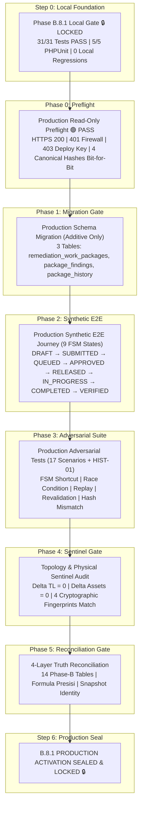

# SIDAK TEJO — Phase B.8.1 Production Activation Plan & Deployment Gate Checklist

**Target Host**: Live Production `https://sidaktejo.site` (IP: `2.57.91.151`)  
**Target Database**: `u532206332_sidaktejo` (Production Authoritative)  
**Governing Specification**: [`B8.1_TECHNICAL_SPECIFICATION_v0.2`](file:///C:/Users/INSPEKSIKOTA/.gemini/antigravity/brain/e5e83a3d-4509-4271-8129-9355c979dd3c/B8.1_TECHNICAL_SPECIFICATION_v0.2.md) (🟢 **SPEC LOCKED**)  
**Architecture Baseline**: [`B8_ARCHITECTURE_GATE_v0.2`](file:///C:/Users/INSPEKSIKOTA/.gemini/antigravity/brain/e5e83a3d-4509-4271-8129-9355c979dd3c/B8_ARCHITECTURE_GATE_v0.2_BASELINE_CANDIDATE.md) (🟢 **OFFICIAL BASELINE / LOCKED**)  
**Baseline Snapshot**: `TOPOLOGY-20260925-243-ad2c9fcb` (243 Active TL, 252 Physical TL, 5,236 Active Assets, 5,549 Physical Assets, 9,418.37 m Span)  
**Predecessor Status**: Phase B.8.1 Local Testbed 🔒 **LOCKED** (31/31 forensic tests PASS, 5/5 PHPUnit PASS)  
**Production Preflight (Phase 0)**: 🟢 **PASS / VERIFIED** (Bit-for-bit identical, $\Delta_{\text{prod}} = 0$)  
**Current Production State**: 🔒 **STRICTLY UNTOUCHED & ISOLATED**  

---

## 1. Activation Overview & Pipeline Architecture

Rencana aktivasi produksi **Phase B.8.1 (Remediation Core)** mengikuti struktur tata kelola bertahap (*staged governance pipeline*) yang telah terbukti pada Phase B.6 dan B.7. 

Aktivasi B.8.1 menambahkan kapabilitas siklus tertutup perbaikan temuan (*closed-loop remediation lifecycle*) secara **aditif murni** (3 tabel baru) dengan jaminan tanpa mutasi atau korupsi pada upstream B.6 (Domain Core), B.7 (Mobile Sync), maupun Master Topologi GIS.

---

## 2. 6-Phase Production Activation Sequence & Gate Checklist

### Phase 0: Production Read-Only Preflight Gate (STATUS: 🟢 PASS)
> [!IMPORTANT]
> **Halt Condition:** Verifikasi awal wajib 100% sukses sebelum write routines atau deployment controller dipanggil. Zero mutation terjadi pada tahap ini.

- [x] **0.1 HTTPS Reachability & Latency**:
  - Endpoint `https://sidaktejo.site` via `2.57.91.151:443` terhubung dengan aman (RTT: 220–400 ms).
- [x] **0.2 Perimeter Firewall Enforcement (HTTP 401)**:
  - Panggilan unauthenticated ke `/mobile-sync/audit` diblokir tepat dengan `HTTP 401 Unauthorized`.
- [x] **0.3 Master Deploy Key Enforcement (HTTP 403)**:
  - Panggilan authenticated tanpa deploy key ke `/mobile-sync/migrate` diblokir dengan `HTTP 403 Forbidden`.
- [x] **0.4 Baseline Production Cryptographic Hash Identity**:
  - Active Translines: Tepat $243$ (`5707f28af259aaca1608b5b595e139ce6dda3b0ffbfe4f1d1ed6c0cb48e40ae5`) 🟢 **IDENTICAL**
  - Physical Translines: Tepat $252$ (`35b82b10cea9acf5fefae7fe551aa9f2b8ca833f09acab2ef4f29f2d3755fad6`) 🟢 **IDENTICAL**
  - Active Assets: Tepat $5,236$ (`83d8260ef2dfd1c8517e28879857fbd9816a3742a353217eef03d6a46a431711`) 🟢 **IDENTICAL**
  - Physical Assets: Tepat $5,549$ (`2e0477b238d5e352be5e9e70d2f57d42b808fd7d8d1d409dc40614c59193152a`) 🟢 **IDENTICAL (64-char hex)**
  - Network Span: Tepat $9,418.37\text{ m}$ ($\Delta_{\text{span}} = 0.00\text{ m}$).
  - Snapshot Identifier: `TOPOLOGY-20260925-243-ad2c9fcb`.
- [x] **0.5 4-Layer Truth Reconciliation Baseline**:
  - Status rekonsiliasi upstream dikonfirmasi berstatus `PASS_AUTHORITATIVE_PRODUCTION`.
  - Berkas log audit tersimpan di `writable/audits/B8_1_PHASE0_PREFLIGHT_REPORT.json`.

---

### Phase 1: Production Schema Migration Verification Gate
> [!NOTE]
> Menambahkan 3 tabel inti remediation secara idempoten via migration runner berotorisasi master deploy key.

- [ ] **1.1 Deploy Key Authorization**:
  - `POST /remediation/migrate` diverifikasi mewajibkan header `X-Deploy-Master-Key`.
- [ ] **1.2 Idempotent DDL Execution (3 Tabel Remediation)**:
  - **Tabel 1: `remediation_work_packages`**:
    - Kolom `client_operation_uuid VARCHAR(64) UNIQUE` (Invariant **B81-G03**).
    - Kolom `package_code VARCHAR(64) UNIQUE`.
    - Kolom `status` ENUM dengan tepat 9 status (`DRAFT`, `ENGINEER_SUBMITTED`, `PENDING_APPROVAL`, `APPROVED`, `REJECTED`, `RELEASED`, `IN_PROGRESS`, `COMPLETED`, `VERIFIED`).
  - **Tabel 2: `remediation_package_findings`**:
    - Composite UNIQUE `(work_package_id, finding_id)`.
    - Foreign Key `work_package_id` $\to$ `remediation_work_packages(id)` (RESTRICT).
    - Foreign Key `finding_id` $\to$ `field_findings(id)` (RESTRICT).
    - Foreign Key `case_id` $\to$ `fault_cases(id)` (RESTRICT).
  - **Tabel 3: `remediation_package_history`**:
    - Foreign Key `work_package_id` $\to$ `remediation_work_packages(id)` dengan **`ON DELETE RESTRICT`** (Invariant **B81-G02: Anti-Cascade**).
    - Struktur ledger audit permanen append-only.
- [ ] **1.3 Upstream Schema Immutability Check**:
  - 7 tabel B.6 + 4 tabel B.7 tetap 100% identik secara struktural.
  - Zero ALTER pada `gis_translines` maupun `assets`.
- [ ] **1.4 Migration Idempotency & Repeat Execution**:
  - Pemanggilan ulang `/remediation/migrate` menghasilkan status `MIGRATION_ALREADY_SEALED` tanpa duplicate index atau table collision error.

---

### Phase 2: Production Synthetic E2E Execution Gate
> [!NOTE]
> Menjalankan siklus penuh 9 status Work Package di lingkungan produksi dengan bendera audit `test_mode = 1` tanpa mematikan atau mengotori data operasional nyata.

- [ ] **2.1 Work Package Idempotent Creation (DRAFT)**:
  - Pembentukan paket pekerjaan sintetis dengan `client_operation_uuid` terstandar (`B81-PROD-SYNTH-...`).
  - Paket terbentuk dalam status `DRAFT` dengan `package_code` berformat kanonikal `WP-YYYYMMDD-XXXX`.
- [ ] **2.2 Atomic Finding Attachment (B81-G01)**:
  - Mengaitkan temuan berstatus `CONFIRMED` menggunakan resource pessimistic locking.
- [ ] **2.3 Pre-Commit Revalidated Submission (B81-G04)**:
  - Eksekusi `submitPackage()` $\to$ status `ENGINEER_SUBMITTED`.
  - Revalidasi live memastikan temuan masih berstatus `CONFIRMED`.
- [ ] **2.4 Approval Queue Transition**:
  - Eksekusi `validateAndQueue()` $\to$ status `PENDING_APPROVAL`.
- [ ] **2.5 Multi-Level Role Authorization (Supervisor Approval)**:
  - Eksekusi `approvePackage()` $\to$ status `APPROVED`.
  - Percobaan approval oleh role non-supervisor ditolak server-side (HTTP 403).
- [ ] **2.6 Operational Release & Team Assignment**:
  - Eksekusi `releasePackage()` $\to$ status `RELEASED` dengan penetapan penanggung jawab tim.
- [ ] **2.7 Physical Execution Start**:
  - Eksekusi `startExecution()` $\to$ status `IN_PROGRESS`.
  - Status item temuan otomatis bertransisi menjadi `IN_REPAIR`.
- [ ] **2.8 Physical Execution Completion**:
  - Eksekusi `completeExecution()` $\to$ status `COMPLETED`.
  - Item temuan ditandai `RESOLVED`.
- [ ] **2.9 QA Verification & Evidence Content Hash Verification (B81-G05)**:
  - Eksekusi `verifyRemediation()` $\to$ status `VERIFIED` (Closed-Loop Sealed).
  - Konten fisik artefak bukti diverifikasi SHA-256 byte-by-byte terhadap digest yang terdaftar.
- [ ] **2.10 Zero DELETE Policy & Historical Audit Ledger**:
  - Seluruh 8 langkah siklus hidup tercatat berurutan di `remediation_package_history`.
  - Record sintetis dipertahankan dengan `test_mode = 1` untuk auditabilitas permanen (zero hard DELETE).

---

### Phase 3: Production Adversarial Test Suite (17 Scenarios + HIST-01)
> [!CAUTION]
> Seluruh skenario adversarial wajib digagalkan oleh server-side firewall/guards dengan kode HTTP yang tepat tanpa menyebabkan efek samping topologi atau mutasi data ilegal.

| Kode Uji | Skenario Uji Negatif & Adversarial | Target Respons | Respon HTTP | Invariant yang Dilindungi |
| :---: | :--- | :--- | :---: | :---: |
| **ADV-01** | FSM Shortcut Ilegal: `DRAFT` $\to$ `APPROVED` | Transisi tidak sah ditolak | `409 Conflict` | FSM Integrity Guard |
| **ADV-02** | Attach temuan berstatus `RECORDED` (bukan `CONFIRMED`) | Ditolak: Wajib `CONFIRMED` | `422 Unprocessable` | Finding Eligibility Guard |
| **ADV-03** | Attach temuan dengan ID fiktif / tidak ada | Ditolak: Finding not found | `404 Not Found` | Relational Foreign Key Guard |
| **ADV-04** | Duplicate Finding dalam satu Work Package | Ditolak oleh unique constraint | `409 Conflict` | Unique Finding Constraint |
| **ADV-05** | Attach temuan yang sudah di paket aktif lain | Ditolak: Single active package | `409 Conflict` | Single Active WP Guard |
| **ADV-06** | Submit paket kosong (0 finding) | Ditolak: Minimal 1 finding | `422 Unprocessable` | Package Validity Guard |
| **ADV-07** | Reject tanpa alasan (`rejection_notes` $< 10$ char) | Ditolak: Catatan penolakan wajib | `422 Unprocessable` | Audit Governance Guard |
| **ADV-08** | Tambah finding pada paket yang sudah `APPROVED` | Ditolak: Paket terkunci | `409 Conflict` | Post-Approval Lock |
| **ADV-09** | QA verify tanpa bukti penyelesaian | Ditolak: Evidence wajib ada | `422 Unprocessable` | Mandatory Evidence Guard |
| **ADV-10** | Evidence hash format cacat (bukan 64-hex SHA-256) | Ditolak: Format hash tidak valid | `422 Unprocessable` | SHA-256 Standard Guard |
| **ADV-11** | Upaya mutasi tabel `gis_translines` via API Remediation | Ditolak: Master GIS read-only | `403 Forbidden` | Topology Immutability Guard |
| **ADV-12** | Topology Sentinel Pre vs Post Execution | $\Delta_{\text{active\_tl}} = 0, \Delta_{\text{assets}} = 0$ | `PASS` ($\Delta = 0$) | Topology Sentinel Invariant |
| **ADV-13** | **Concurrent Attach Race pada Finding yang Sama** | **1 Transaksi Commit, 1 Rollback** | `409 Conflict` | **B81-G01 Atomicity Guard** |
| **ADV-14** | **Retry Create dengan `client_operation_uuid` Sama** | **Mengembalikan WP eksisting** | `200 OK` (Replay) | **B81-G03 Idempotency Guard** |
| **ADV-15** | **Status Finding berubah pasca-attach sebelum Submit** | **Submit diblokir oleh revalidasi** | `409 Conflict` | **B81-G04 Revalidation Guard** |
| **ADV-16** | **Status Finding berubah pasca-submit sebelum Approve**| **Approve diblokir oleh revalidasi** | `409 Conflict` | **B81-G04 Revalidation Guard** |
| **ADV-17** | **Evidence format valid (64-hex) tapi konten mismatch**| **Ditolak oleh verifikasi konten** | `422 HASH_MISMATCH`| **B81-G05 Evidence Integrity** |
| **HIST-01**| **Upaya Physical DELETE Work Package Bersejarah** | **Ditolak oleh ON DELETE RESTRICT** | `ERROR 1451 / 405` | **B81-G02 Non-Cascade Guard** |

---

### Phase 4: Topology & Physical Sentinel Verification Gate
> [!IMPORTANT]
> Kebenaran jaringan listrik authoritative harus terbukti bit-for-bit identik sebelum dan sesudah seluruh siklus pengujian.

| Parameter Jaringan | Baseline Canonical Terkunci | Toleransi Delta ($\Delta$) | Metode Verifikasi |
| :--- | :---: | :---: | :--- |
| **Active Translines** | $243$ | $\mathbf{0}$ | Exact row count & SHA-256 fingerprint bit-for-bit |
| **Physical Translines** | $252$ | $\mathbf{0}$ | Exact row count & SHA-256 fingerprint bit-for-bit |
| **Active Assets** | $5,236$ | $\mathbf{0}$ | Exact row count & SHA-256 fingerprint bit-for-bit |
| **Physical Assets** | $5,549$ | $\mathbf{0}$ | Exact row count & SHA-256 fingerprint bit-for-bit |
| **Network Span** | $9,418.37\text{ m}$ | $\mathbf{0.00\text{ m}}$ | Geodesic sum calculation |
| **Inactive Translines** | $9$ | $\mathbf{0}$ | Row count verification |
| **Soft-Deleted Assets** | $313$ | $\mathbf{0}$ | Row count verification |

---

### Phase 5: 4-Layer Truth Reconciliation Gate

- [ ] **Layer 1 — Application Engine**:
  - `RemediationWorkPackageService` version: `B8.1-REMEDIATION-1.0` (SEALED)
  - Upstream Services: `B7-SYNC-1.0`, `B7-EVIDENCE-1.0`, `B7-PULL-1.0` (SEALED)
- [ ] **Layer 2 — Physical Database Layer**:
  - Total Phase B Tables: $7_{\text{B.6}} + 4_{\text{B.7}} + 3_{\text{B.8.1}} = 14$ authoritative Phase B tables.
  - Physical integrity: $252$ translines, $5,549$ assets.
- [ ] **Layer 3 — Authoritative View Layer**:
  - Active integrity: $243$ translines, $5,236$ assets.
  - Presisi formulasi rekonsiliasi:
    $$243_{\text{active}} + 9_{\text{inactive}} = 252_{\text{physical}}$$
    $$5,236_{\text{active}} + 313_{\text{soft-deleted}} = 5,549_{\text{physical}}$$
- [ ] **Layer 4 — Topology Snapshot Layer**:
  - Snapshot identifier: `TOPOLOGY-20260925-243-ad2c9fcb` permanen dan bit-for-bit identical.

---

### Phase 6: Final Cryptographic Seal & Production Activation Lock
- [ ] Penerbitan Production Seal ID: `B81-SEAL-YYYYMMDD-xxxxxxxxxxxxxxxx`.
- [ ] Pencatatan 64-karakter SHA-256 full seal fingerprint.
- [ ] Penguncian status Phase B.8.1: **`PASS / SEALED / LOCKED`**.
- [ ] Pembukaan resmi gerbang arsitektur sub-fase berikutnya (**Phase B.8.2 — Material Requisition FSM**).

---

## 3. Protokol Keamanan & Emergency Abort

1. **Automatic Pipeline Abort**:
   - Jika Phase 0 (Preflight) mendeteksi ketidakcocokan hash: proses dihentikan seketika tanpa ada koneksi tulis.
   - Jika Phase 1 (Migration) mengalami error DDL: rollback otomatis, upstream tables tidak tersentuh.
   - Jika ditemukan $\Delta_{\text{topology}} \neq 0$ pada tahap mana pun: emergency halt diaktifkan seketika.
2. **Zero-Deletion Policy**:
   - Seluruh record pengujian sintetis (`test_mode = 1`) dipertahankan secara permanen untuk jejak forensik audit.
   - Operasi `DELETE` diblokir oleh foreign key `RESTRICT` dan service guard `HTTP 405`.
3. **Audit Ledger Immutability**:
   - Setiap tahap eksekusi menyimpan log terperinci di `writable/audits/B8_1_PRODUCTION_ACTIVATION_REPORT.json`.
